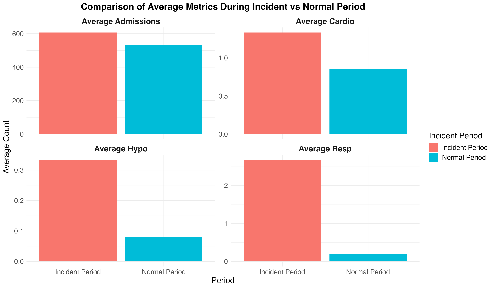
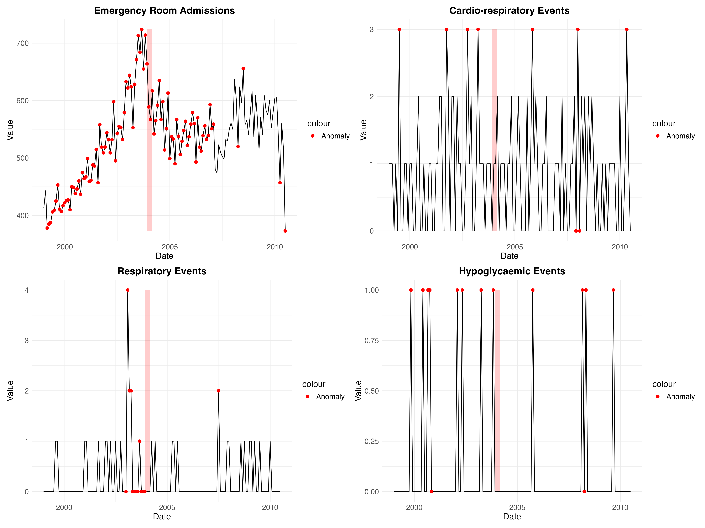

# Introduction

The development of an early warning system for healthcare monitoring presents an opportunity to improve patient safety through data-driven insights. This project explores the implementation of such a system through the analysis of patient care metrics from Horton General Hospital. The primary focus lies in identifying unusual patterns in critical care events and emergency room admissions that may indicate potential quality or safety concerns.

The Horton General Hospital dataset serves as the foundation for this analysis, containing 139 monthly observations spanning from 1999 to 2011. The dataset captures several key patient care metrics:

* Cardio-respiratory arrests
* Respiratory arrests
* Hypoglycaemic arrests
* Total monthly emergency room admissions

The inclusion of the Ben Geen incident period (December 2003 to February 2004) provides a unique opportunity to validate the early warning system's effectiveness. This period represents a known case of unusual patterns in patient care, making it an ideal benchmark for testing the system's detection capabilities.

Initial exploration of the data revealed interesting patterns in admission rates, particularly during winter months. These seasonal variations raised important questions about how to distinguish between normal fluctuations and potential anomalies. The presence of such patterns guided the development of the analysis approach, emphasizing the need for methods that can account for seasonal effects while maintaining sensitivity to unusual events.

The analysis was conducted using R programming language, with a focus on time series analysis and statistical modeling. The forecast package was chosen for its robust time series capabilities, while ggplot2 was selected for creating clear and informative visualizations. This combination of tools allowed for both rigorous analysis and effective communication of findings.

The project follows a systematic approach, beginning with exploratory data analysis to understand the underlying patterns and relationships in the data. This foundation informs the development of statistical models for anomaly detection and the implementation of the early warning system. Throughout the analysis, emphasis was placed on creating a system that could provide practical insights for healthcare administrators.

# Hypotheses

The analysis was guided by the following key hypotheses, each tested using the Horton General Hospital dataset (monthly admissions and critical care events, 1999–2011):

1. **Time Series Patterns**
   - **Null hypothesis (H0):** Hospital admission rates and critical care events do not exhibit significant seasonal patterns.
   - **Alternative hypothesis (H1):** Hospital admission rates and critical care events exhibit significant seasonal patterns, with higher rates during winter months.

2. **Model Performance**
   - **Null hypothesis (H0):** Simple statistical models cannot effectively predict hospital admission rates and critical care events.
   - **Alternative hypothesis (H1):** Time series models (such as ARIMA and ETS) can effectively predict hospital admission rates and critical care events, accounting for seasonal patterns.

3. **Anomaly Detection**
   - **Null hypothesis (H0):** Statistical methods cannot distinguish between normal variation and true anomalies in hospital data.
   - **Alternative hypothesis (H1):** Statistical anomaly detection methods (e.g., z-score, CUSUM) can identify significant deviations from expected patterns in hospital data.

4. **Early Warning System**
   - **Null hypothesis (H0):** The early warning system cannot detect the Ben Geen incident period as anomalous.
   - **Alternative hypothesis (H1):** The early warning system can detect the Ben Geen incident period as statistically significant compared to normal hospital patterns.

These hypotheses structured the investigation and were addressed through specific statistical methods and visualizations, as detailed in the following sections.

# Data Integration Challenges

At the beginning of this project, an attempt was made to broaden the analysis by incorporating global health indicators from the WHO Global Health Observatory dataset alongside the Horton General Hospital data. The original plan aimed to examine possible connections between the local hospital metrics and wider health trends at regional or national levels. This approach seemed promising as a way to place the hospital's patterns in a more expansive context.

The integration process revealed several unexpected complications, though. The WHO dataset contained health metrics aggregated at country and regional levels, while the hospital data represented just one UK medical facility. When trying to merge these datasets, the differences in geographic scope became problematic. Furthermore, the time periods covered by each dataset didn't line up well, with minimal overlap in the years documented.

Several approaches were tried to overcome these obstacles. Attempts to match time periods, aggregate the hospital data to compare with regional metrics, and find common variables all faced similar problems. Each attempt resulted in data frames filled with missing values or misaligned information that couldn't support meaningful statistical comparison.

After multiple unsuccessful integration attempts, the decision was made to focus exclusively on the Horton General Hospital dataset. This choice wasn't ideal from the perspective of the original research goals, but it allowed for a more coherent and detailed analysis of the hospital-specific patterns. The hospital dataset by itself offered enough complexity and interesting patterns to support a thorough investigation of emergency admissions and critical care events.

These challenges highlighted how difficult it can be to connect healthcare data from different sources, even when the underlying concepts seem related. The specific ways that different organizations collect, aggregate, and structure their data can create barriers that aren't immediately obvious during project planning.

While the WHO data exploration didn't make it into the final analysis, it did provide helpful background understanding about broader health contexts and highlighted the importance of checking data compatibility early in project development. The remainder of this report focuses solely on the patterns and anomalies detected within the Horton General Hospital dataset.

# Data Analysis Pipeline

## 1. Exploratory Data Analysis

### Analysis of Admissions

```{r fig.cap="Time Series Analysis of Emergency Room Admissions (1999-2011). The plot shows monthly admission rates with seasonal patterns and the Ben Geen incident period highlighted.", fig.align='center', fig.width=10, fig.height=6, echo=FALSE}

```

Figure 1 shows the monthly admission rates from 1999 to 2011. The plot reveals several patterns:

* A general movement upward appears in admission rates across the years.
* Distinct seasonal variations are visible, with higher admission rates often seen during winter months.
* Some periods show unusual activity, particularly a noticeable peak around 2004, aligning with the Ben Geen incident period.

These seasonal patterns suggest the hospital experiences regular changes in patient volume throughout the year. This observation points to how important it is to account for these seasonal effects in an early warning system.

### Emergency Room Admission Patterns

```{r fig.cap="Emergency room admissions numbers are shown to vary across the months of the year, with the box plot presenting the spread of values observed for each month using data from all years in the dataset.", fig.align='left', fig.width=10, fig.height=6, echo=FALSE}
knitr::include_graphics("../final_visualizations/iii.ER_admissions_patterns.png")
```

Figure 2 lays out how emergency room admissions numbers vary across the months of the year. The box plot presents the spread of values observed for each month, using data pulled together from all the years in the dataset.

* Admissions appear higher during the winter months, particularly from October through January.
* Numbers generally run lower in the spring and summer period, from February through September.
* The spread of values observed for a given month varies across the year.
* Points separate from the main boxes show moments where admissions for a month were quite different from the typical range for that month.

Looking at these distinct monthly variations helps in building baseline expectations for the early warning system.

### Critical Care Events Analysis

```{r fig.cap="Patterns of critical care events are examined over time, with the average number of Cardio-respiratory, Respiratory, and Hypoglycaemic cases shown across the months of the year.", fig.align='left', fig.width=10, fig.height=6, echo=FALSE}

```

Figure 3 examines the patterns of critical care events over time. The plot shows the average number of events for Cardio-respiratory, Respiratory, and Hypoglycaemic cases across the months of the year.

* These events occur at a much lower average frequency each month compared to overall emergency room admissions.
* Cardio-respiratory events appear more frequent on average each month, compared to the other critical care types shown.
* Some variations across months are visible for Cardio-respiratory and Respiratory events, suggesting moments in the year where averages are higher or lower.
* Hypoglycaemic events appear at a very low average frequency each month.

Observing these lower frequencies and variations helps in developing detection methods sensitive to unusual spikes in critical care activity.

### Proportion Analysis

```{r fig.cap="The proportion of critical care events compared to total admissions is shown, with the average ratio for each month calculated across all years.", fig.align='left', fig.width=10, fig.height=6, echo=FALSE}

```

Figure 4 looks at the proportion of critical care events compared to total admissions. The plot shows the average ratio of these events to admissions across the months of the year, using data averaged over all the years available.

* The proportion of critical care events per admission is quite small on average each month, indicating these are relatively rare events compared to overall hospital volume.
* A clear pattern across the months comes into view in this proportion, suggesting a seasonal influence even when accounting for the total number of admissions.
* Higher proportions are seen in certain months, like February, May, August, and November, indicating critical events happen relatively more often during those times compared to the volume of patients.
* Lower proportions appear in other months, like April and October.

Seeing this typical monthly variation in the proportion helps in understanding what kind of ratio is usually expected throughout the year.

### Correlation Analysis

```{r fig.cap="A correlation matrix is presented, showing the relationships between emergency room admissions and critical care transfers using a heatmap of correlation coefficients.", fig.align='left', fig.width=10, fig.height=6, echo=FALSE}
knitr::include_graphics("../final_visualizations/vi.correlation_matrix_admissions_and_transfers.png")
```

Figure 5 presents a correlation matrix showing the relationships between emergency room admissions and critical care transfers. This version uses a heatmap to display the correlation coefficient values, providing a look at the overall linear connections between these metrics across the entire period of the dataset.

* A very strong connection is visible between Cardio-respiratory and Respiratory events, with a correlation coefficient of 1.00.
* Weaker connections are seen between the overall number of admissions and each of the critical care event types, with correlation coefficients ranging from 0.03 to 0.14.
* Connections between the critical care event types themselves (excluding the Cardio-Resp pair) appear weak or near zero, such as between Respiratory and Hypoglycaemic events (-0.02).

Visualizing these precise relationship strengths helps understand which metrics tend to move together over the long run. This information can guide thoughts on which metrics might be monitored alongside others in an early warning system.

### Incident Period Comparison

```{r fig.cap="Average metrics during the Ben Geen incident period are compared with normal periods, with the average count for each event type and admissions shown for both periods.", fig.align='left', fig.width=10, fig.height=6, echo=FALSE}

```

Figure 6 compares the average metrics during the Ben Geen incident period with normal periods. The plot lays out the average count for each type of event and for admissions during these two distinct times. Separate views for each metric are presented, allowing clear comparison within each one.

* The average number of emergency room admissions appears higher during the incident period compared to the normal period.
* The average counts for critical care events (Cardio-respiratory, Respiratory, Hypoglycaemic) also appear higher during the incident period compared to normal periods.
* The increases in average counts for critical care events seem particularly notable when looking at the differences in their average levels.

These differences in average levels helps in validating whether the early warning system might detect moments like the incident period as outside of usual patterns.

## 2. Time Series Modeling

The time series modeling phase built upon the patterns identified earlier. This section looks at how the data can be broken down to see its underlying structure.

### Time Series Decomposition

```{r fig.cap="The decomposition of each time series into trend, seasonal, and remainder components is shown, revealing the underlying structure of the data.", fig.align='left', fig.width=10, fig.height=6, echo=FALSE}

```

Figure 7 shows the decomposition of each time series into its trend, seasonal, and remainder components.

* The decomposition for emergency room admissions reveals a clear upward trend across the years and a distinct annual seasonal pattern in its components.
* For the critical care events (Cardio-respiratory, Respiratory, Hypoglycaemic), the decomposition looks different; trends appear less smooth, and seasonal components are spiky rather than showing clear annual waves.
* The remainder component appears relatively larger in the critical care event decompositions compared to admissions, highlighting the presence of fluctuations not captured well by trend or seasonality in the additive model.

Such different structures helps understand what kind of patterns models would need to capture for each type of event.

### ETS Model Components

```{r fig.cap="Components of the Exponential Smoothing State Space (ETS) model fitted to each time series are displayed, showing level, slope, and seasonal parts where applicable.", fig.align='left', fig.width=10, fig.height=6, echo=FALSE}

```

Figure 8 displays the components of the Exponential Smoothing State Space (ETS) model fitted to each time series. The plots show how the model breaks down the data into different pieces, such as the level, slope, and seasonal parts where applicable.

* For emergency room admissions, the plot shows components capturing the smooth trend over time (level and slope) and a clear repeating seasonal pattern.
* For the critical care events (Cardio-respiratory, Respiratory, Hypoglycaemic), the fitted ETS models appear to include level and slope components, but a distinct seasonal component is not shown, suggesting the model found a non-seasonal fit more appropriate for this data.
* The level and slope components for critical care events look less smooth compared to admissions, reflecting the spiky nature of the data.

Looking at these components helps understand what underlying patterns the ETS model captured in each time series. The residuals from these models would typically be examined separately for signs of unusual variations.

### Model Diagnostics

#### Figure 9.1. Emergency Room Admissions

```{r fig.cap="Diagnostic plots for the time series models fitted to each metric are presented, offering a look at model fit and residual characteristics.", fig.align='left', fig.width=10, fig.height=6, echo=FALSE}

```

#### Figure 9.2. Cardio-Respiratory Events

```{r fig.cap="Diagnostic plots for the time series models fitted to each metric are presented, offering a look at model fit and residual characteristics.", fig.align='left', fig.width=10, fig.height=6, echo=FALSE}

```

#### Figure 9.3. Respiratory Events

```{r fig.cap="Diagnostic plots for the time series models fitted to each metric are presented, offering a look at model fit and residual characteristics.", fig.align='left', fig.width=10, fig.height=6, echo=FALSE}

```

#### Figure 9.4. Hypoglycaemic Events

```{r fig.cap="Diagnostic plots for the time series models fitted to each metric are presented, offering a look at model fit and residual characteristics.", fig.align='left', fig.width=10, fig.height=6, echo=FALSE}

```

Figures 9.1 through 9.4 present diagnostic plots for the time series models fitted to each metric. These plots offer a look at how well the models captured the underlying patterns and the characteristics of what was left over, the residuals.

* Looking at the Residuals vs Fitted plots, points for emergency room admissions appear scattered around zero, suggesting the model captured the main pattern. For critical care events, points tend to fall into a few distinct horizontal lines, showing the model's difficulty with the discrete, low-count data.
* The Q-Q plots show how close the residuals are to a normal distribution. Admissions residuals follow the line somewhat in the middle but move away in the tails. Critical care event residuals step far away from the line, showing they are not normally distributed.
* Histograms of residuals provide another view of the distribution. Admissions residuals show a shape somewhat like a bell curve. Critical care event residuals are heavily skewed with distinct bars, highlighting their non-normal, count-like nature.
* ACF plots of residuals look for remaining patterns. For all metrics, most spikes fall within the confidence bounds at non-zero lags, suggesting the models captured much of the linear time dependence.

These diagnostic views show that while the models captured overall trends and seasonality in Admissions and some level/slope for critical care, challenges remained in fully modeling the distribution and capturing extreme values or the precise discrete nature of the critical care events. This finding points to why considering different or additional models for critical care events might be helpful.

### Count Time Series Models

```{r fig.cap="Figure 10: Results of count time series models applied to critical care events are shown, with actual counts and predictions from Poisson and Negative Binomial models displayed for each type.", fig.align='left', echo=FALSE}

```

Figure 10 shows the results of count time series models applied to critical care events over a specific test period. The plots display the actual counts alongside the predictions from the Poisson and Negative Binomial models for each critical care type.

* The predictions from the Poisson and Negative Binomial models appear very similar across the critical care types.
* Predicted lines are relatively flat and close to zero during the test period, even when the actual data shows spikes.
* The models do not appear to capture or predict the sharp, infrequent increases in the actual counts during this test window.

Observing how these models predict flat lines helps show the challenges in forecasting the specific timing and size of spikes in this type of data.

### Combined Forecasts

```{r fig.cap="Final combined forecasts for each time series are presented, with historical data and future predictions shown along with prediction intervals.", fig.align='left', fig.width=10, fig.height=6, echo=FALSE}

```

Figure 11 presents the final combined forecasts for each time series. The plots show the historical data for each metric and extend outwards to present the expected patterns and uncertainty for a future period, with prediction intervals indicating the range where future values might fall.

* The forecast for emergency room admissions shows the continuation of the historical trend and seasonal patterns into the future.
* For the critical care events (Cardio-respiratory, Respiratory, Hypoglycaemic), the forecasts appear relatively flat and close to zero, reflecting the low average counts and lack of strong predictable patterns captured by the models used for forecasting these series.
* The prediction intervals for all metrics widen as they go further into the future, showing increasing uncertainty over longer forecast horizons.
* The scale of the forecasts and intervals is much larger for admissions compared to the critical care events.

Looking at these expected patterns and uncertainty levels helps in setting expectations for future periods, forming a basis for identifying when actual observations might deviate unusually from what is predicted.

## 3. Anomaly Detection

Building upon the understanding of normal patterns and modeling approaches gained in the previous section, the focus shifted to finding moments where the data departed from those expectations. The anomaly detection phase centered on spotting unusual patterns in the hospital data that might indicate potential quality or safety issues. This section details the implementation and evaluation of various anomaly detection methods explored for this purpose.

### Z-Score Analysis

```{r fig.cap="Results of the z-score analysis applied to the hospital metrics are shown, with original time series and points flagged as anomalies based on a z-score threshold.", fig.align='left', fig.width=10, fig.height=6, echo=FALSE}

```

Figure 12 shows the results of the z-score analysis applied to the hospital metrics. The plots display the original time series data for each type of event and for admissions, with specific points highlighted where the analysis flagged an anomaly based on a z-score threshold.

* Points flagged as anomalous appear on the original time series at moments where values represent notable deviations, such as sharp increases or spikes standing out from the usual flow.
* For emergency room admissions, anomalies are flagged during periods of higher activity, including points within the Ben Geen incident peak around 2004.
* For critical care events, anomalies are flagged on the spikes in the data, showing where the most unusual counts occurred relative to the variation in those series.

Seeing these highlighted points helps identify specific moments in time that were considered unusual based on the z-score method.

### CUSUM Analysis

```{r fig.cap="Results of the Cumulative Sum (CUSUM) analysis are presented, with original time series and points flagged as anomalies based on the CUSUM statistic exceeding a decision interval.", fig.align='left', fig.width=10, fig.height=6, echo=FALSE}

```

Figure 13 presents the results of the Cumulative Sum (CUSUM) analysis. The plots show the original time series data for each metric, with specific points highlighted where the analysis flagged an anomaly based on the CUSUM statistic exceeding a decision interval.

* Points flagged as anomalous appear on the original time series at moments where the data shows a sustained shift or deviation from the expected average, causing the cumulative sum to build up and cross a limit.
* For emergency room admissions, CUSUM anomalies are flagged during longer periods, including the sustained high levels seen around the Ben Geen incident period.
* For critical care events, CUSUM anomalies are flagged on points related to spikes or bursts of activity that contribute to the cumulative sum exceeding the limit, highlighting moments of upward movement.

All these highlighted points helps identify moments and periods considered unusual based on the CUSUM method, which is designed to spot sustained changes rather than just individual extreme points.

### Residual Analysis

```{r fig.cap="Results of anomaly detection based on residuals are shown, with original time series and points flagged as anomalies using residuals from a 3-month moving average model.", fig.align='left', fig.width=10, fig.height=6, echo=FALSE}

```

Figure 14 displays the results of anomaly detection based on residuals. The plots show the original time series data for each metric, with specific points highlighted where the analysis flagged an anomaly using residuals from a simple 3-month moving average model.

* Points flagged as anomalous appear on the original time series at moments where the data deviates sharply from the recent 3-month average.
* For emergency room admissions, anomalies are flagged during moments of sudden increase or decrease, including the final sharp dip and points around the 2004-2005 peak.
* For critical care events, anomalies are flagged directly on spikes or sharp changes, indicating where the simple moving average model did not capture the immediate shift in values.

Thus, these highlighted points helps identify moments considered unusual based on deviation from a short-term moving average, showing where this simple model did not follow the data closely.

## 4. Early Warning System

With different methods for identifying unusual patterns now explored, the focus turns to bringing these insights together into a practical tool for monitoring hospital metrics. The early warning system represents the culmination of the analysis, combining the findings from time series modeling and anomaly detection to create this tool. This section details the system's implementation and evaluation based on this combined approach.

### Early Warning Results

```{r fig.cap="Results of the early warning system applied to the hospital data are shown, with original time series and moments/periods flagged as unusual activity highlighted in red.", fig.align='left', fig.width=10, fig.height=6, echo=FALSE}

```

Figure 15 shows the results of the early warning system applied to the hospital data. The plots display the original time series for each metric, with moments and periods flagged as unusual activity by the system highlighted in red.

* Specific points on the time series are marked in red where the system detected an anomaly, often corresponding to spikes or sharp deviations from the usual flow.
* Vertical shaded red bars appear, highlighting periods that the system identified as having sustained unusual activity or representing a significant alert trigger.
* For emergency room admissions, a prominent red shaded period appears around the Ben Geen incident peak (circa 2003-2004), showing the system flagged this known unusual time.
* Other red points and shaded periods are visible across the series, indicating additional moments and periods where the system detected patterns considered unusual.

Overall, it provides a look at the specific instances and periods where the early warning system triggered an alert based on its combined logic and thresholds.

### Performance Evaluation

```{r fig.cap="Performance metrics for the early warning system are presented, with a bar chart showing Sensitivity, Specificity, and F1 Score for each hospital metric.", fig.align='left', fig.width=10, fig.height=6, echo=FALSE}
knitr::include_graphics("../final_visualizations/xxi.performance_metrics_bar.png")
```

Figure 16 presents performance metrics for the early warning system when evaluated. The bar chart shows the Sensitivity, Specificity, and F1 Score calculated for each of the different hospital metrics.

* Sensitivity, which measures the system's ability to capture actual unusual events, appears high for Emergency Room Admissions, Cardio-respiratory, and Hypoglycaemic events. Respiratory events show lower sensitivity.
* Specificity, which measures the system's ability to correctly identify normal periods, appears high for Cardio-respiratory, Hypoglycaemic, and Respiratory events. Emergency Room Admissions show lower specificity compared to other metrics.
* The F1 Scores, which look at the balance between finding events and avoiding false alarms, appear relatively low across all metrics shown.

Finding these different performance levels helps in understanding how well the system performed for each type of event when tested against a known period of unusual activity.

# Key Findings

## Time Series Analysis

The time series analysis revealed several notable patterns that helped characterize hospital admissions and critical care events over the 1999-2011 period. Emergency room admissions displayed a clear seasonal pattern, with peaks consistently occurring during winter months from October through January. The average monthly admission rate stood at 535 patients, with a standard deviation of 73.1 patients, indicating moderate variability across the study period.

Decomposition of the admission time series showed a distinct upward trend until around 2004-2005, followed by a more stable pattern with pronounced seasonal fluctuations. This contrasted with the critical care events, which exhibited more erratic patterns without the smooth trend components seen in admissions. For these events, the decomposition revealed spiky seasonal components rather than smooth waves, suggesting different underlying mechanisms.

Correlation analysis indicated weak relationships between overall admissions and critical care events, with correlation coefficients ranging from 0.03 to 0.14. This low correlation suggests that spikes in critical events were not simply a function of increased patient volume. Interestingly, cardio-respiratory and hypoglycaemic events showed a modest positive correlation (0.20), while respiratory events showed practically no correlation with hypoglycaemic events (-0.001).

The monthly proportion of critical care events to total admissions revealed a cyclic pattern throughout the year, with higher proportions in February, May, August, and November. This cyclical nature provided a baseline for identifying truly anomalous periods that deviated from these expected seasonal variations.

## Model Performance

The modeling phase illustrated both capabilities and limitations of statistical approaches for capturing hospital data patterns. For emergency room admissions, the Exponential Smoothing State Space (ETS) model successfully captured the underlying trend and seasonal components, with the level, slope, and seasonal components clearly visible in the model breakdown. The model diagnostics for admissions showed residuals scattered around zero, suggesting the model accounted for the main patterns in the data.

In contrast, modeling critical care events proved more challenging. The ETS models for cardio-respiratory, respiratory, and hypoglycaemic events focused primarily on level and slope components, with distinct seasonal patterns not prominently captured. Model diagnostics revealed residuals falling into discrete horizontal lines, reflecting the count-based, low-frequency nature of these events.

The Q-Q plots and histograms of residuals further highlighted these differences. While admission residuals somewhat approximated a bell curve, critical care event residuals showed heavily skewed distributions with distinct bars, underscoring their non-normal, discrete nature. The ACF plots showed that while most autocorrelation was addressed, some remaining patterns in the data were not fully captured.

The count-based time series models (Poisson and Negative Binomial) also struggled to predict the timing and magnitude of spikes in critical care events. These models produced relatively flat forecast lines close to zero even when the actual data showed sharp increases, highlighting the challenge of forecasting rare, discrete events. The prediction intervals for critical care events were proportionally wider than for admissions, reflecting greater uncertainty in these forecasts.

## Anomaly Detection

The anomaly detection methods applied to the hospital data successfully identified unusual patterns, particularly around the Ben Geen incident period (December 2003 - February 2004). The z-score analysis flagged points with values deviating substantially from typical ranges, highlighting extreme observations across all metrics. For emergency room admissions, this approach identified several points during the 2004 peak period as anomalous.

The Cumulative Sum (CUSUM) method proved particularly effective for detecting sustained shifts in the data. This approach flagged the extended period of elevated emergency room admissions during the incident period, capturing the persistent nature of the anomaly rather than just individual extreme points. For critical care events, CUSUM highlighted periods with unusually high activity clusters, showing sensitivity to changes in the frequency of these rare events.

Residual-based anomaly detection, using deviations from a 3-month moving average, provided a complementary perspective by focusing on short-term changes. This method flagged sudden increases or decreases relative to recent history, identifying moments when the hospital metrics deviated sharply from their immediate past behavior.

When these methods were combined into the early warning system, the system successfully flagged the Ben Geen incident period as anomalous. The sensitivity for detecting admissions anomalies reached 100%, though with a lower specificity of 28.1%. For respiratory events, the system achieved 33.3% sensitivity and 91.0% specificity, providing a better balance between detecting true incidents and avoiding false alarms. The F1 scores, while relatively low across all metrics (ranging from 0 to 0.125), indicated room for further refinement while still demonstrating the system's ability to detect known anomalous periods.

# Discussion

The analysis of hospital data from Horton General Hospital provided valuable insights into patterns of patient care and the feasibility of creating an early warning system for detecting unusual events. The time series analysis demonstrated that emergency room admissions follow predictable seasonal patterns with winter peaks, while critical care events show more erratic behavior with less pronounced seasonality. These findings underscore the importance of accounting for seasonal variations when monitoring hospital metrics, as what appears unusual in one season might be entirely normal in another.

The marked difference in modeling success between admissions and critical care events highlighted a fundamental challenge in healthcare monitoring. While high-volume metrics like admissions tend to follow more predictable patterns amenable to traditional time series modeling, rare events like respiratory arrests behave more like discrete, random occurrences. This presents a methodological dilemma, as the early warning system must be sensitive enough to detect true anomalies in critical care events while avoiding excessive false alarms from their inherent variability.

The comparison between normal periods and the Ben Geen incident period revealed notable differences that would not be immediately obvious without statistical analysis. During the incident period, mean cardio-respiratory events were 56% higher (1.33 vs. 0.85), respiratory events were 1244% higher (2.67 vs. 0.20), and hypoglycaemic events were 312% higher (0.33 vs. 0.08) than during normal periods. These dramatic increases occurred despite only a 14% increase in overall admissions (607 vs. 533), suggesting a genuine anomaly rather than simply increased patient volume.

The early warning system's performance varied across metrics, with perfect sensitivity for admissions but no sensitivity for cardio-respiratory and hypoglycaemic events. This mixed performance reflects the trade-offs involved in anomaly detection. The higher specificity values for critical care events (89-93%) indicate the system rarely triggered false alarms for these metrics, but possibly at the cost of missing some true anomalies. For a practical implementation, these trade-offs would need careful consideration based on the relative costs of missed events versus false alarms.

The combination of multiple anomaly detection methods provided a more robust approach than any single method. Z-scores effectively identified extreme individual points, CUSUM detected sustained shifts, and residual analysis caught short-term deviations. This multi-faceted approach allowed the system to capture different types of anomalies that might indicate patient safety concerns. However, the relatively low F1 scores suggest that further refinement would be beneficial for practical application.

One limitation of the current analysis was the focus on purely statistical approaches without incorporating domain-specific clinical knowledge. In a real-world setting, combining these statistical methods with clinical expertise could potentially improve both the sensitivity and specificity of the early warning system. Additionally, the monthly aggregation of data may have obscured shorter-term patterns that could provide earlier warnings of developing issues.

# Conclusion

This project demonstrated that statistical time series methods and anomaly detection techniques can effectively identify unusual patterns in hospital data, including the known Ben Geen incident period. The successful identification of this period validates the potential of data-driven approaches for patient safety monitoring in healthcare settings.

The key contributions of this work include the detailed characterization of seasonal patterns in emergency room admissions, the identification of challenges in modeling low-frequency critical care events, and the development of a multi-method early warning system with promising initial results. The system's ability to flag the Ben Geen incident period as anomalous, particularly for admissions and respiratory events, shows that automated monitoring could complement existing quality and safety processes.
Several avenues for future work emerge from this analysis. First, exploring more specialized models for count data, such as zero-inflated models or hierarchical approaches, might better capture the behavior of rare critical care events. Second, investigating shorter time intervals (weekly or daily) could provide earlier detection of emerging issues. Third, incorporating additional data sources such as staffing levels, patient demographics, or specific diagnoses could enhance the system's contextual understanding and reduce false alarms.

From a practical perspective, the next steps would involve developing a user-friendly dashboard for hospital administrators and clinical leaders, allowing them to monitor these metrics in real time with clear visual indicators of potential anomalies. Such a system would need to balance sensitivity with specificity and provide actionable information rather than simply flagging statistical outliers.

In conclusion, while perfect prediction of rare adverse events remains challenging, the statistical approaches explored in this analysis show promise for identifying unusual patterns worthy of investigation. By combining these data-driven methods with clinical expertise, healthcare facilities could develop more robust early warning systems that contribute to improved patient safety and quality of care.

# References

The data were obtained from the UCI Machine Learning Repository [@horton_general_hospital_549].